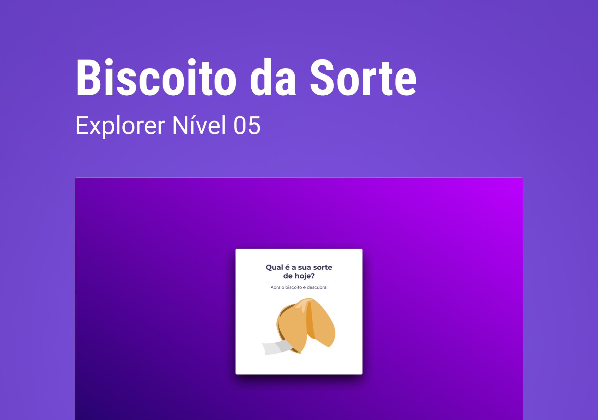

  

## 💻 Projeto
Esse projeto foi desenvolvido como desafio das aulas do Stage 05 no Explorer da [Rocketseat](https://rocketseat.com.br).

### O que foi colocado em prática:
- Animações CSS
- Manipulação de DOM
- Uso das funções <b><i>Math.round()</i></b> e <b><i>Math.random()</i></b> 
- Uso de eventos
- Funções callback
- Arrays

## 🚀 Tecnologias

Esse projeto foi desenvolvido com as seguintes tecnologias:

- HTML
- CSS
- JavaScript

## 🔖 Layout

Você pode ver o layout do projeto
[aqui](https://www.figma.com/community/file/1182751789348533739).
